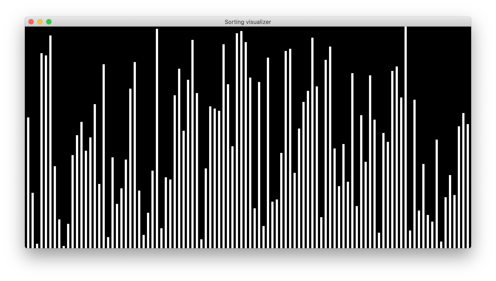
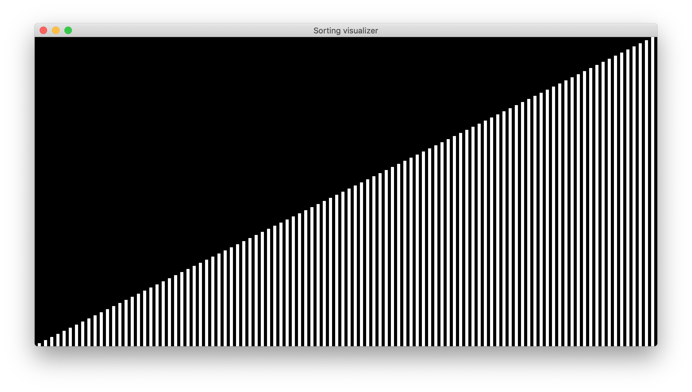

# sort-visualize-demo

 
This demo visualizes and animates common sorting algorithms using Java and Swing, including:

- Bubble sort
- Selection sort
- Merge sort
- Quick sort
- Counting sort
- Radix sort

Each algorithm is associated with different expectations of time complexity in various scenarios. Visualizing how the algorithms sort through a shuffled data set can help to explain how each algorithm works.

In this demo, unsorted data is represented as a set of bars with varied heights:

After being sorted, the bars ascend linearly:

